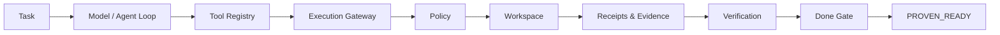

<div align="center">

# Kodac

**Done means proven.**

Model-agnostic agentic engineering with bounded execution, verification, evidence, and proof-oriented completion.

[](LICENSE)


</div>

---

## What is Kodac?

Kodac is an open agentic software-engineering platform designed to make AI-assisted changes **bounded, inspectable, verifiable, and evidence-backed**.

Most coding agents optimize for producing an answer or a patch. Kodac is built around a stricter question:

> **What evidence proves this change is actually ready?**

The platform separates model reasoning from execution authority, routes side effects through policy, records execution receipts, runs independent verification, and lets a dedicated **Done Gate** decide whether work is proven ready.

```text
Understand → Plan → Build → Verify → Prove
```

## Why Kodac

Kodac is being built around five core ideas:

- **Model-independent execution** — providers can change without changing the trust model.
- **Bounded authority** — tools and writes operate through explicit policy and workspace boundaries.
- **Evidence by default** — important actions produce machine-readable events, receipts, and artifacts.
- **Verification outside the model** — tests and verification do not depend on the model claiming success.
- **Done means proven** — completion is a system decision, not assistant prose.

## Runtime architecture



The K2 runtime follows a canonical execution path:

```text
CLI
→ RuntimeSession
→ kodac.event
→ ToolRegistry
→ RuntimeOrchestrator
→ ExecutionGateway
→ Policy
→ Workspace
→ ReceiptLedger
→ Verification
→ DoneGate
```

## K2 proof points

The current K2 development branch has completed the first real controlled end-to-end runtime proof.

| Capability | Result |
|---|---:|
| Real OpenAI provider qualification | **PASS — 9/9** |
| Real controlled model-driven write | **PASS** |
| Exact write-scope enforcement | **PASS** |
| Independent verification | **PASS** |
| Done Gate | **PROVEN_READY** |
| Runtime tests | **80 / 80 PASS** |
| Typecheck | **PASS** |
| Patch benchmark | **PASS** |
| Cross-platform CI | **Ubuntu / Windows / macOS PASS** |
| Stable runtime required-check gate | **PASS** |

These results apply to the K2 development branch and its preserved evidence. They do **not** imply that K2 has already merged into canonical `main` or that a public release has been authorized.

### Explore K2

- [K2 runtime branch](https://github.com/IamShehri/Kodac/tree/feat/kodac-k2-runtime-spine)
- [Runtime package](https://github.com/IamShehri/Kodac/tree/feat/kodac-k2-runtime-spine/packages/kodac-runtime)
- [Architecture decisions](https://github.com/IamShehri/Kodac/tree/feat/kodac-k2-runtime-spine/docs/adr)
- [Governance records](https://github.com/IamShehri/Kodac/tree/feat/kodac-k2-runtime-spine/docs/governance)
- [K2 planning and technical evidence records](https://github.com/IamShehri/Kodac/tree/feat/kodac-k2-runtime-spine/docs/planning)

## Repository map

| Area | Purpose | Current location |
|---|---|---|
| `agents/` | Evidence-backed agent profiles | `main` |
| `matrix/` | Deterministic comparison views | `main` |
| `schema/` | Profile and provenance contracts | `main` + K2 |
| `tools/` | Validation and generation tooling | `main` + K2 |
| `packages/kodac-runtime/` | Trusted agent runtime | K2 branch |
| `docs/adr/` | Accepted architecture decisions | K2 branch |
| `docs/governance/` | Protection and governance truth | K2 branch |
| `docs/planning/` | Milestone and evidence closeout records | K2 branch |
| `provenance/` | OSS intake and authorization records | K2 branch |

## Kodac Evidence Catalog

Kodac also preserves an evidence-backed catalog for comparing AI coding agents without collapsing everything into a marketing score.

The catalog uses sourced YAML profiles, strict schemas, content digests, verification dates, and explicit claim states such as:

- `verified`
- `vendor-reported`
- `unknown`
- `disputed`

Useful entry points:

- [Agent Matrix](matrix/AGENT_MATRIX.md)
- [OpenCode profile](agents/opencode/profile.yaml)
- [Profile sourcing methodology](docs/methodology/PROFILE_SOURCING.md)

The catalog intentionally does **not** publish a universal overall winner score.

## Quick start — evidence catalog

```bash
git clone https://github.com/IamShehri/Kodac.git
cd Kodac

uv sync
uv run python -m tools.validate_profiles
uv run python -m tools.generate_matrix --check
uv run pytest -q
uv run ruff check .
```

Python 3.11+ and [uv](https://github.com/astral-sh/uv) are required for the evidence-catalog toolchain.

## Quick start — K2 runtime development

```bash
git clone https://github.com/IamShehri/Kodac.git
cd Kodac
git switch feat/kodac-k2-runtime-spine

cd packages/kodac-runtime
npm test
npm run bench:patch
```

The K2 runtime currently targets **Node.js 24+** and is intentionally private/unpublished as a package while the runtime architecture is still being integrated.

## Trust model

Kodac's runtime is designed so that model output alone cannot establish readiness.

Key boundaries include:

- workspace confinement and traversal rejection;
- explicit allow / ask / deny policy decisions;
- bounded agent-loop budgets;
- no-shell verification commands from a controlled executable catalog;
- provider stream limits and fail-closed error handling;
- receipts for controlled side effects;
- exact write-scope enforcement for controlled live execution;
- verification evidence required before `PROVEN_READY`.

## Governance

Kodac separates technical proof from release authority.

Current state:

- **K2 technical proof:** PASS
- **Protected `main`:** active repository ruleset
- **Required checks:** `provenance`, `legacy-tests`, `k2-runtime-gate`
- **K2 merge into `main`:** pending protected PR process
- **Public brand launch:** not authorized by technical proof alone
- **Name clearance:** not established

This separation is intentional: a technically proven runtime is not automatically a release decision.

<details>
<summary><strong>Project history</strong></summary>

Earlier Kernux evidence-catalog work is preserved as historical and research input rather than being destructively removed. Kodac is not merely a rename; the project was reconstituted around a new runtime and governance architecture focused on trusted execution, verification, evidence, and proof-oriented completion.

Earlier trust-kernel / OmniBridge experiments remain historical and are not part of the current Kodac architecture.

</details>

## License

Kodac is licensed under the [Apache License 2.0](LICENSE).

---

<div align="center">

**Kodac — Done means proven.**

</div>
